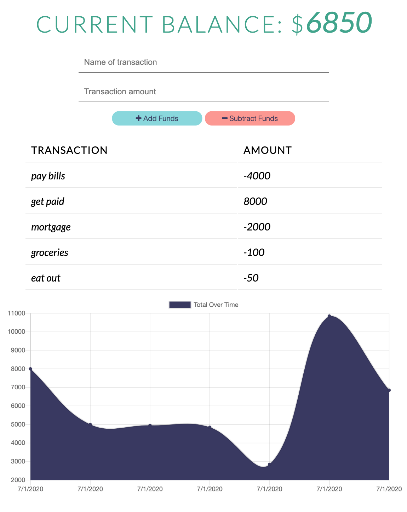

# Budget Tracker

Giving users a fast and easy way to track their money is important, but allowing them to access that information anytime is even more important. This simple application uses Webpack and Indexddb to create an app that you can download off the web and continue to use even without any kind of internet access. Buget Tracker is a Progressive Web App (PWA) that is a  cross-platform, no-download experience with all the benefits of a web app and a native app. 

### **Please [click here](https://wpa-budget-app.herokuapp.com/) to visit the app page.**




## User Story 

```
AS AN avid traveller
I WANT to be able to track my withdrawals and deposits with or without a data/internet connection
SO THAT my account balance is accurate when I am traveling
```

## Using the App 

The app keeps track of the users money by storing all transactions and displaying the flow of cash on a chart. 

The user chooses to either withdrawl or deposit by giving the transaction a name and amount, then clicking either `add funds` or `subtract funds` buttons. 

When a user is on Budget Tracker without an internet connection & either inputs a withdrawal or deposit, that will be shown on the page, and added to their transaction history when their connection is back online.

## Technolgies Used 

* HTML & CSS 
* Javascript 
* Mongo DB
* Indexddb
* NPM Package Express
* NPM Package Morgan
* NPM Package Mongoose
* NPM Package compression
* Webpack (WebpackPwaManifest & babel-loader)


## Future Development Ideas 

* Add more graphs that user can toggle between to isolate dates 
* Add feature where user can break down income into percentages and track budget by transaction type 
* upgrades to graph UI 
* Add type (budget) and dates to transactions list
